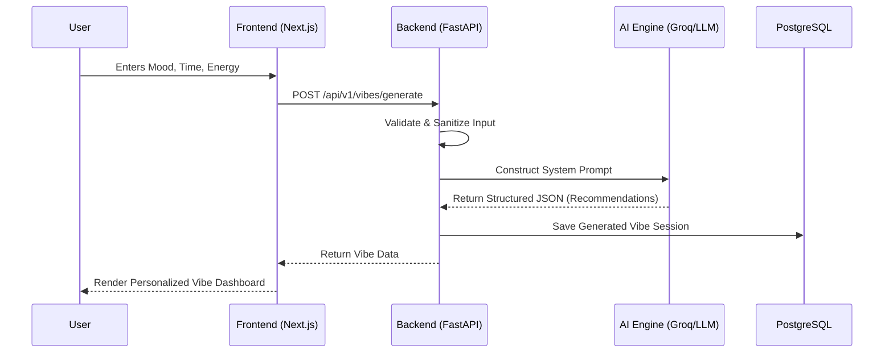

<div align="center">
  
# 🌌 VibeSync AI
**Your mood. Your time. Your universe.**

A personalized, AI-powered entertainment discovery platform that creates tailored Vibe sessions based on your current mood, available time, energy levels, and preferences.


[](https://vibesync-ai.vercel.app)
[](#)
[](#)
[](#)
[](#)
[](#)
[](#)

</div>

---

## 🎯 What it does
Have you ever felt overwhelmed by choices when you just want to relax? VibeSync AI solves the "paradox of choice" by instantly generating a perfect blend of entertainment to match exactly how you feel right now. 

You provide your current mood, how much time you have, and your energy level. Our AI engine processes this and crafts a **Vibe** — a curated session that can include:
- 🎵 Music & Playlists
- 🎬 Time-aware Movie & Video Recommendations
- 📚 Book Suggestions
- 🖼️ Visual Moodboards

No more scrolling for hours. Just pure vibes.


---

## ✨ Features

- **🧠 AI-Powered Curation**: Leverages LLMs to understand complex mood combinations and contextual needs.
- **⏱️ Time-Aware Suggestions**: Recommends a 20-minute YouTube video when you have a short break, or an epic 2.5-hour movie when you have the whole evening.
- **🎨 Visual Moodboards**: Generates aesthetic references and Pinterest boards that visually match your vibe.
- **💾 History & Favorites**: Save your favorite generated vibes and revisit them whenever you want to recapture that feeling.
- **⚡ Blazing Fast UI**: Built on Next.js App Router for an instantaneous, seamless user experience.

---

## 🏗️ Architecture & Workflow

Here is how the magic happens from the moment you click "Generate":



---

## 📂 Folder Structure

```text
VibeSync-AI/
├── frontend/                # Next.js web application
│   ├── public/              # Static assets
│   ├── src/
│   │   ├── app/             # App Router pages and layouts
│   │   ├── components/      # Reusable React components
│   │   ├── lib/             # Utility functions & API clients
│   │   └── types/           # TypeScript definitions
│   └── package.json         # Frontend dependencies
├── backend/                 # FastAPI Python server
│   ├── app/
│   │   ├── api/             # Route handlers
│   │   ├── core/            # Config, security, database setup
│   │   ├── models/          # SQLAlchemy ORM models
│   │   ├── schemas/         # Pydantic schemas for validation
│   │   └── services/        # Business logic & AI integration
│   ├── tests/               # Pytest suite
│   ├── migrations/          # Alembic database migrations
│   └── requirements.txt     # Python dependencies
├── docs/                    # Project documentation
├── notes/                   # Dev notes and scratchpads
└── render.yaml              # Deployment configuration
```

---

## 🚀 Setup & Deployment

It's easy to get VibeSync AI running on your local machine.

### Prerequisites
- Node.js 18+
- Python 3.11+
- PostgreSQL (Local or Cloud)
- Groq API Key (or other supported LLM provider)

### 1. Clone the Repository
```bash
git clone https://github.com/Santhoshcv07/VibeSync_AI.git
cd VibeSync_AI
```

### 2. Frontend Setup
```bash
cd frontend
cp .env.example .env.local
# Add your environment variables to .env.local
npm install
npm run dev
```
The frontend will be running at `http://localhost:3000`.

### 3. Backend Setup
Open a new terminal and navigate to the project root:
```bash
cd backend
python -m venv .venv
source .venv/bin/activate  # On Windows: .venv\Scripts\activate
pip install -r requirements.txt

cp .env.example .env
# Configure your DB connection and API keys in .env

# Run database migrations
alembic upgrade head

# Start the server
uvicorn app.main:app --reload
```
The backend API will be available at `http://localhost:8000`.

---

## 🔮 Use Cases & Future Scope

**Use Cases:**
- **The Commuter**: Needs exactly 35 minutes of engaging audio/video for the train ride.
- **The Weekend Winder-Downer**: Wants low-energy, highly aesthetic content for a rainy Sunday evening.
- **The Study Session**: Needs 2 hours of high-focus instrumental music and aesthetic visuals without distracting lyrics or heavy plots.

**Future Scope:**
- 🎵 **Spotify / Apple Music Integration**: Direct playlist generation.
- 📺 **Streaming Service Deep Links**: Click directly into Netflix, Hulu, or Max for the suggested movie.
- 👫 **Shared Vibes**: Generate vibes tailored for multiple people based on blended preferences.
- 📱 **Mobile App**: Port the experience to React Native for on-the-go discovery.

---

## 🤝 Contribution

We welcome contributions to make VibeSync AI even better! 

1. Fork the Project
2. Create your Feature Branch (`git checkout -b feature/AmazingFeature`)
3. Commit your Changes (`git commit -m 'Add some AmazingFeature'`)
4. Push to the Branch (`git push origin feature/AmazingFeature`)
5. Open a Pull Request

---
<div align="center">
<i>Built with ❤️</i>
</div>
